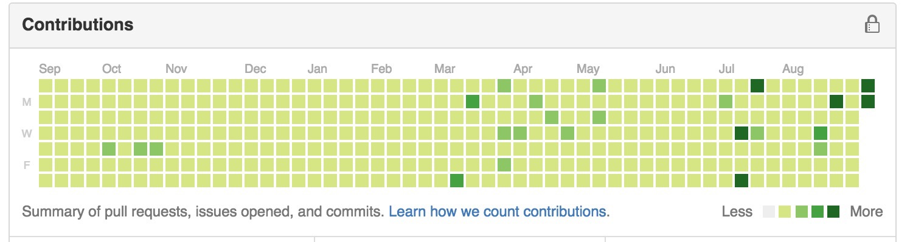

# gitGreen
Let me make your github all green.

###使用方法

1,本地安装Node环境，git建立一个gitgreen的项目.

2,
<code>
node gitgreen.js
</code>

注：由于网速的不尽相同，所以每个人设置的时间阀值也不相同。

###1,这基本是不可能的

写的原因竟是看到知乎上的一个问题 [在Github上保持365天全绿是怎样一种体验](http://www.zhihu.com/question/34043434);

###2,这真的不太可能

以前曾最多坚持过连续3个月，连续push了90多天。后来想想，其实有些都是周六周天做的一些无用功罢了。

过年、过节或者周末，我觉得还是多陪陪家人，多陪陪妹子比较好。

其实是根本不会计较这些东西的。

###最后

希望大家能够在enjoy coding的同时，多关心关心你周围的人。

如果真的365一直都绿下去，可能，你就真的找不到女票了吧。

这是一个极其简易的版本，希望大家能够提供更好的改进，比如精确的push时间控制，一年前clearInterval()等等。

enjoy it !!!
